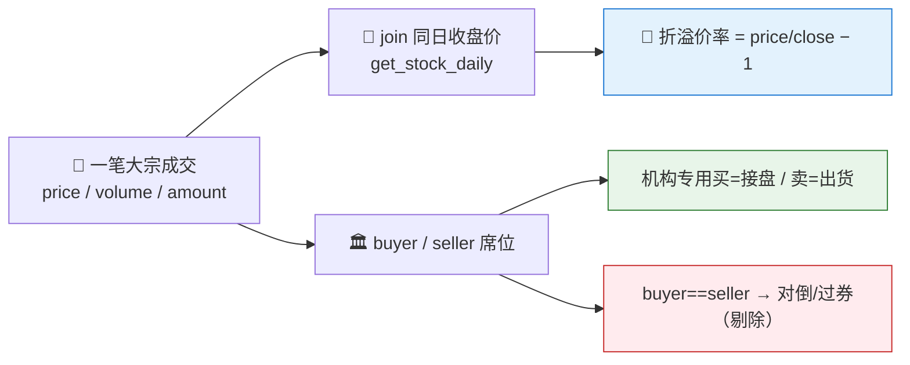

# 🎯 Block Trade Radar Skill

**简体中文** | [English](README.en.md)

> A股**大宗交易折溢价雷达**：把每笔大宗成交价对齐**同日收盘价**算折溢价率、读**机构专用**买卖方向、标记**重复折价接盘**与**同营业部对倒式**打款、按成交额与折溢价排榜 —— 全市场扫描或单票时间线，每个数据点标注来源接口与交易日、每个折溢价标注收盘基准。

<p align="center">
  
  
  
  
  
  
</p>

---

## 📖 这是什么

`block-trade-radar` 是一个 **Agent Skill**：以**大宗交易**为中心扫描 A 股 `get_block_trade`，回答"**最近谁在折价接盘/溢价出货、折溢价多深、机构专用是接还是抛、哪些打款是同营业部对倒**"。

`get_block_trade` **一笔成交返回一行**（`symbol`+`date`+`sequence_id`），大额减持常被拆成多笔。**折溢价率不是接口字段** —— 本技能用 `get_stock_daily` 的**同日收盘价** join 出来：`折溢价率 = 成交价 / 同日收盘价 − 1`（负=折价，正=溢价）。`机构专用`在买方=**接盘**、在卖方=**出货**（匿名席位，不指名）；`buyer==seller` 视为**对倒/过券**，单列并剔除出方向净额。每个结论标注来源接口、交易日与折溢价基准；扫描是**某时点的快照**。

> 数据契约一律来自姊妹技能 [`pandadata-api`](https://github.com/quantskills/skill-pandadata-api)；本技能负责"查什么、怎么算折溢价、怎么去对倒、怎么排榜"，不负责"接口长什么样"。

---

## 🧭 与同生态技能的边界（避免撞车）

| 技能 | 视角 | 何时用 |
|---|---|---|
| 🎯 **block-trade-radar**（本技能） | **大宗交易折溢价** 全市场扫描 / 单票时间线 | "扫一遍最近的大宗""哪些深折价接盘""大宗成交额榜""某票大宗折溢价" |
| 📈 `market-daily-review` | 每日全市场复盘（大宗只是其中一行） | 想看完整盘后复盘 → 移交它 |
| 🧠 `smart-money-profiler` | 龙虎榜/北向/两融**营业部**聪明钱 | 想看盘面龙虎榜席位 → 移交它（大宗是场外另一通道） |
| 🚨 `event-risk-alert` | 自选/持仓**风险**事件（解禁/质押/减持） | 想监控自己持仓风险 → 移交它 |

---

## 🧬 大宗交易模型（分析前必读）



- **折溢价率**（自算）：`成交价 / 同日收盘价 − 1`；负=折价（常见，买方要折扣接盘）、正=溢价（较少）；收盘价缺失记 `待补` 并剔除。
- **方向**：`机构专用`买方=接盘、卖方=出货，匿名席位不指名。
- **对倒式**：`buyer==seller` 同营业部，视为内部过券，单列并剔除出方向净额。
- **聚合**：按 `symbol`+`date` 聚合（笔数、总成交额、成交额加权折溢价率），再排榜。

---

## 🗂️ 报告章节 × 接口映射

| 章节 | 接口 | 回答什么 |
|---|---|---|
| 📋 **大宗成交总览** | `get_block_trade` | 窗口内笔数、涉及名称、总成交额 |
| 📊 **折溢价分布** | `get_block_trade`（`price`）+ `get_stock_daily`（收盘） | 深折价/折价/平价/溢价各多少、折溢价多深 |
| 🏛️ **机构专用方向** | `get_block_trade`（`buyer`·`seller`） | 净接盘 vs 净出货 |
| 🏆 **成交额/折价榜** | `get_block_trade`（`amount`）+ 折溢价率 | 成交额 Top、最深折价、重复折价名称 |
| 🔁 **对倒式提示** | `get_block_trade`（`buyer==seller`） | 同营业部打款，剔除出方向净额 |
| 🏭 **行业分布** | `get_stock_industry` + 上述 | 哪些行业大宗最活跃 |

---

## 🚀 快速开始

### 1️⃣ 安装（与 pandadata-api 一起）

```bash
# Claude Code（全局）
cp -r skill-pandadata-api     ~/.claude/skills/pandadata-api
cp -r skill-block-trade-radar ~/.claude/skills/block-trade-radar

# Codex（全局，Agent Skills 标准目录）
mkdir -p ~/.agents/skills
cp -r skill-pandadata-api     ~/.agents/skills/pandadata-api
cp -r skill-block-trade-radar ~/.agents/skills/block-trade-radar

# Cursor（项目级）
mkdir -p .cursor/skills
cp -r skill-pandadata-api     .cursor/skills/pandadata-api
cp -r skill-block-trade-radar .cursor/skills/block-trade-radar
```

### 2️⃣ 直接用自然语言提问

```text
扫一遍最近 30 个交易日全市场的大宗交易，给我折溢价分布和机构专用方向
最近有哪些深折价接盘？按折价率排个序
600519.SH 最近的大宗交易折溢价多深？机构在接还是在抛
帮我做一份大宗成交额榜，把同营业部对倒的剔除掉
设置一个每交易日盘后自动跑的大宗交易雷达任务
```

### 3️⃣ 报告结构（8 章）

```
摘要 → 大宗成交总览 → 折溢价分布 → 机构专用方向
→ 成交额/折价榜 → 对倒式提示 → 风险提示 → 数据说明
```

数据说明为表格：`数据模块 | 来源接口 | 查询窗口 | 返回笔数/名称数 | 快照日/交易日区间 | 折溢价基准 | 备注`。

---

## ⏰ 定时（可选）

在交易日盘后（建议 `18:00 Asia/Shanghai` 之后）运行，捕捉当日大宗成交。任务幂等：`reports/block-trade/<scope>-<date>.md` 已存在则覆盖重写；非交易日跳过。

---

## 📦 目录结构

```
block-trade-radar/
├── SKILL.md                        # 技能入口：定位边界、大宗交易模型、工作流、接口映射、分析模式、规则、自动化
├── references/
│   └── block-trade-playbook.md     # 📒 路由表、折溢价公式与边界、方向/对倒规则、聚合规则、报告骨架、空数据处理、QA清单
├── scripts/
│   └── validate_report.py          # ✅ 校验报告章节/来源标注/折溢价基准/机构与对倒口径/窗口/免责声明
└── agents/
    ├── cursor-rule.mdc             # Cursor 适配
    ├── openai.yaml                 # OpenAI/Codex 适配
    └── portable-loader.md          # Claude Code/Hermes/OpenClaw 适配
```

---

## 📐 核心约束

| 约束 | 说明 |
|---|---|
| 🧾 先查契约 | 所有调用先经 `pandadata-api` 核对 `get_block_trade` / `get_stock_daily` 参数字段 |
| 📐 折溢价须标基准 | 折溢价率=成交价/同日收盘价−1，须注明用 `get_stock_daily` 同日收盘价；缺失记"待补" |
| 🏛️ 机构专用不指名 | `机构专用`为匿名席位，读买卖方向可以，不虚构具体机构 |
| 🔁 对倒单列 | `buyer==seller` 视为对倒/过券，单列并剔除出方向净额 |
| 🧮 先聚合再排榜 | 大额常拆多笔，按 `symbol`+`date` 聚合后再排成交额/折价榜 |
| 📸 快照属性 | 大宗成交持续累积，扫描是某时点快照，须标注快照日/交易日区间 |
| 🕳️ 空数据如实报 | 无大宗成交保留标题写明"无数据 + 方法/窗口" |
| 🗣️ 措辞克制 | 用"折价接盘""净接盘/净出货""可能提示承接/派发意愿"，不下涨跌结论，不用买卖语言 |

---

## ⚠️ 免责声明

本报告基于公开数据与规则化分析生成，仅供研究参考，不构成任何投资建议。

## 📜 License

This project is licensed under the GNU General Public License v3.0. See [LICENSE](LICENSE).

维护者：`abgyjaguo`

## 🐼 PandaAI / QUANTSKILLS 社群

<div align="center">
  
  <br>
  <sub>扫码加入 PandaAI 社群，交流 QUANTSKILLS 技能、Agent 工作流与量化研究实践。</sub>
</div>
